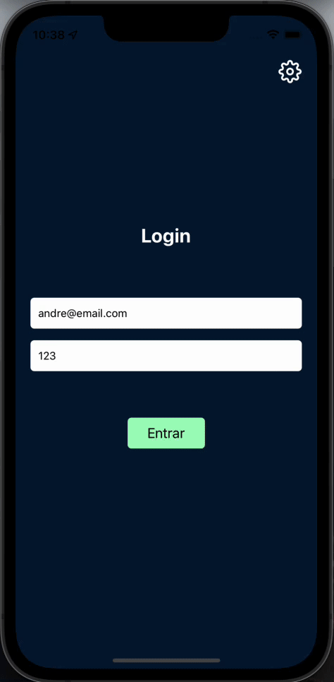

<h4 align="center"> 
	Commerce
</h4>
Projeto de React Native - Context API, trabalhei com a navegação entre as telas. Para acessar a informação de uma tela em outra, normalmente passei essa navegação via props. Entretanto, isso vai se tornando impraticável quando o aplicativo vai crescendo e possuindo várias telas.

O Context veio para resolver exatamente esse problema, já que ele deixa essa informação visível e acessável de forma global na aplicação. Ele pode ser utilizado em qualquer tela ou componente, sem ter que passar a navegação via props.

O Context API não se resume só a isso, podendo ser utilizado em várias situações. Usarei em três situações diferentes. Venham conferir comigo no projeto.

Esse é um projeto de e-commerce. Logo na primeira tela temos o uso do Context API: usaremos na parte de autenticação. 

Em resumo, autenticação é onde fazemos o login da aplicação, digitando e-mail e senha. Assim recuperamos os dados do usuário que está logando no sistema. Preenchendo os campos e apertando o botão "Entrar", vamos para tela de produtos.

Na tela de produtos, temos os produtos do nosso e-commerce. Eles estão em cards retangulares brancos que ocupam de uma borda a outra da tela. No lado esquerdo do card tem o ícone do produto, já ao lado direito do ícone, tem o nome do produto e, abaixo, o preço. Na extrema direita do card, temos um botão quadrado e verde com um "+" branco dentro.

Graças ao Context API, conseguiremos salvar esses produtos na lista de carrinhos. Se clicarmos no botão "+", estamos adicionando os produtos na nossa lista de carrinhos. Esses produtos também ficam acima dos demais, em uma faixa com um tom de azul mais claro que o fundo. Nessa faixa está escrito "Últimos vistos", seguido de versões menores de cards desses produtos adicionados.

Cliquei no "+" dos primeiros três produtos e percebemos que, no canto inferior direito do carrinho, tem um círculo vermelho com o número 3 dentro, indicando que há três produtos no carrinho. Se clicarmos no ícone do carrinho, vamos para tela "Resumo", mostrando os produtos adicionados ao carrinho.

Isso tudo foi feito sem ter que passar via props na navegação, já que está visível globalmente em toda a aplicação. Também temos a tela "Finalizar", para onde somos direcionados ao clicarmos no botão "Finalizar" na parte inferior da tela "Resumo".

A tela "Finalizar" exibe as informações do usuário que entrou no sistema, que vieram da autenticação. Isso também foi passado via Context API. Na parte superior da tela "Resumo" há as informações de entrega, que são o nome, endereço, e-mail e telefone do usuário. Em seguida há a quantidade de produtos e o preço total.

Na parte inferior da tela, aparece novamente o botão "Finalizar". Ao clicar nele, volta para tela principal, finalizando a compra, como mostra um aviso no centro da tela.

Utilizamos o Context em outra situação muito comum, tanto em sites, quanto aplicativos, que é a alteração do tema. Se clicarmos no ícone de engrenagem, no canto superior direito, iremos para tela de configurações. Na tela "Configurações", conseguimos alterar o tema de toda aplicação de escuro para claro, apertando na chave.
Ao apertar a chave, as cores do aplicativo foram alteradas do tema escuro para o tema claro, inclusive a tela de Login, como vemos se voltamos para ela. Percebi que toda aplicação foi alterada de forma global, graças ao Context API.


<p align="center">
  <a href="#information_source-o-que-é-o-ficando-online">O que é o AluraCommerce?</a>&nbsp;&nbsp;&nbsp;|&nbsp;&nbsp;&nbsp;
  <a href="#rocket-Tecnologias">Tecnologias</a>&nbsp;&nbsp;&nbsp;|&nbsp;&nbsp;&nbsp;
  <a href="#information_source-como-usar">Como usar</a>&nbsp;&nbsp;&nbsp;|&nbsp;&nbsp;&nbsp;
</p>

## :information_source: O que é o Commerce?

O AluraCommerce é uma aplicação feita em React Native que simula um e-commerce. A ideia é usar o Context API, do react, para ver a vantagem de se ter estados globais na aplicação. Também é usado o AsyncStorage e uma Web API para ter a persistência dos dados.

Esse projeto é utilizado na formação base de React Native.


<h1 align="center">
    
</h1>


## :rocket: Tecnologias

Esse projeto foi desenvolvido com a utilização das seguintes tecnologias:
- [React Native][rn]
- [Expo][expo]

## :information_source: Como usar

Para copiar e executar essa aplicação, você precisa de três pré-requisitos: [Git](https://git-scm.com), [Node.js][nodejs] + [Yarn][yarn] intalados no seu computador.

No terminal, digite os comandos a seguir:

### Baixar e instalar o projeto

```bash
# Clonar esse repositório
$ git clone https://github.com/alura-cursos/react-native-context-api.git

# Vá para o ropositório
$ cd AluraCommerce

# Instale as dependências
$ npm install
```

### Executar o Mobile

```bash
# Execute em outro terminal (dentro da pasta da empresa)
$ expo start
```

### Executar a Web API

```bash
# Execute em outro terminal (dentro da pasta da empresa)
# Lembre-se de alterar o endereco ip (192.168.15.43) para o do seu computador!
$ json-server --watch --host 192.168.15.43 db.json
```

Espero que você utilize ao máximo deste projeto para se aprimorar! E se quiser dar um salve, estou lá no LinkedIn.

:wave: 

[nodejs]: https://nodejs.org/
[expo]: https://docs.expo.dev/
[rn]: https://facebook.github.io/react-native/
[yarn]: https://yarnpkg.com/
